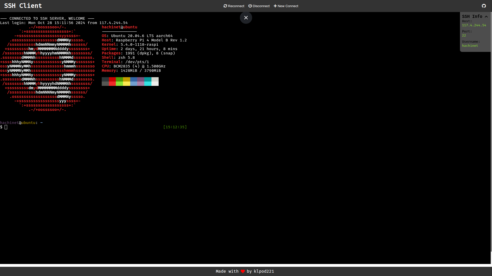
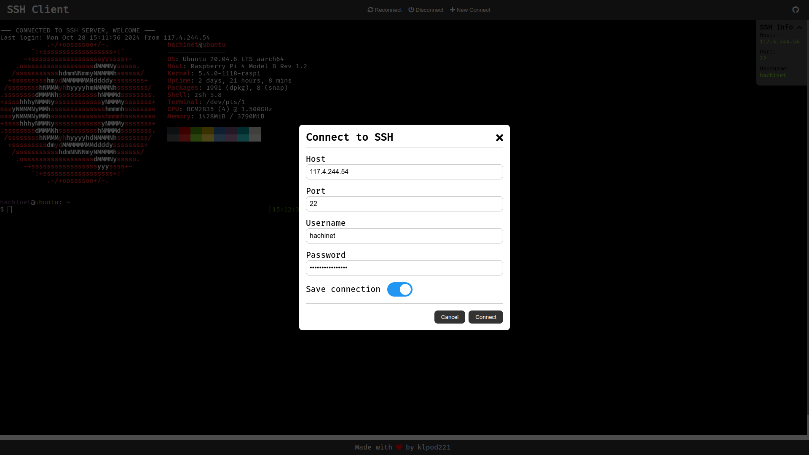

<div align="center">
    <h1>--// Web Base SSH Client //--</h1>
    
    
    
</div>

## About

This is a simple SSH client that allows you to connect to a remote server and execute commands. It is written in JavaScipt and uses the `ssh2` library to establish a connection.

## Demo Image





## Dependencies

- [Node.js](https://nodejs.org/en/) - I am currently using version 20.10.0
- [ssh2](https://www.npmjs.com/package/ssh2) - This is the library that allows us to connect to a remote server via SSH
- [xterm](https://www.npmjs.com/package/xterm) - This is the terminal emulator that we are using to display the output of the commands
- [xterm-addon-fit](https://www.npmjs.com/package/xterm-addon-fit) - This is an addon for xterm that allows the terminal to resize itself to fit the container
- [express](https://www.npmjs.com/package/express) - This is a web framework for Node.js that we are using to create a simple web server
- [socket.io](https://www.npmjs.com/package/socket.io) - This is a library that allows us to create a real-time, bidirectional communication between the client and the server
- [utf8](https://www.npmjs.com/package/utf8) - This is a library that allows us to encode and decode UTF-8 strings
- [nodemon](https://www.npmjs.com/package/nodemon) - This is a utility that will monitor for any changes in your source and automatically restart your server
- [ejs](https://www.npmjs.com/package/ejs) - This is a simple templating language that lets you generate HTML markup with plain JavaScript

## Development

To get started, clone the repository and install the dependencies:

```bash
git clone https://github.com/klpod221/ssh-client.git
cd ssh-client
npm install
```

To start the development server, run:

```bash
npm run dev
```

This will start the server on `http://localhost:3000`. You can now open your browser and navigate to this URL to see the SSH client in action.
